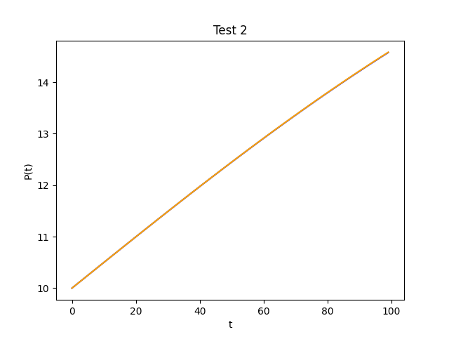

# Assignment #5

## Task 1

I wrote the following python code to perform the Implicit Euler Method:

### Code (`task1.py`):

```py
import numpy as np
import matplotlib.pyplot as plt

from find_root import newton

def implicit_euler(a, b, p0, n=100, h=1):

    fp = lambda p: 1 - a * h + 2 * h * b * p
    
    p_vals = np.zeros((n), dtype=float)
    p_vals[0] = p0
    for i in range(1, n):
        f = lambda p: p - p_vals[i-1] - h * (a * p - b * p * p)
        p_vals[i] = newton(f, fp, p_vals[i-1], 0.0001, 100)

    return zip(*[[i*h, p_vals[i]] for i in range(n)])


# driver code
if __name__ == "__main__":
    tests = [
        {'num': 1, 'a': 0.2},
        {'num': 2, 'a': 0.01},
        {'num': 3, 'a': 2.0}
    ]
    for test in tests:
        x, y = implicit_euler(test['a'], 0.0005, 10)
        plt.title(f'Test {test["num"]}')
        plt.xlabel('t')
        plt.ylabel('P(t)')
        plt.plot(x, y)
        plt.savefig(f"./task1/test{test['num']}.png")
        plt.clf()
```

The code uses the routine I wrote previously to find the root in each iteration. The driver code tests the function for 3 different alpha values and outputs graphs the results:

### Test 1: Alpha = 0.2


### Test 2: Alpha = 0.01


### Test 3: Alpha = 2


## Task 2

I implemented the analytical solution as shown:

### Code (`task2.py`):

```py
import numpy as np

def analytic_euler(a, b, p, n=100, h=1.0):
    vals = [[i*h, a / ((a / p - b) * np.e ** (-a * i*h) + b)] for i in range(n)]
    return zip(*vals)
```

## Task 3

I wrote the following code to compare the analytic method and implicit method:

### Code (`task3.py`):

```py
import matplotlib.pyplot as plt

from task1 import implicit_euler
from task2 import analytic_euler

if __name__ == "__main__":
    tests = [
        {'num': 1, 'a': 0.2},
        {'num': 2, 'a': 0.01},
        {'num': 3, 'a': 2.0}
    ]
    for test in tests:
        x1, y1 = implicit_euler(test['a'], 0.0005, 10)
        x2, y2 = analytic_euler(test['a'], 0.0005, 10)

        plt.title(f'Test {test["num"]}')
        plt.xlabel('t')
        plt.ylabel('P(t)')
        plt.plot(x1, y1, 'blue', label='Implicit')
        plt.plot(x2, y2, 'orange', label='Analytic')
        plt.savefig(f"./task3/test{test['num']}.png")
        plt.clf()
```

### Test 1: Alpha = 0.2


### Test 2: Alpha = 0.01


### Test 3: Alpha = 2


Tests 1 and 2 have very similar curves between each method, which was expected. However, the two curves in test 3 are entirely different. I checked my code and wasn't able to find any obvious errors that could cause it, so it's hard to say where exactly the issue may have come from.

## Task 4

### Code (`task4.py`):

```py
import numpy as np


def trapezoid(f, a, b, n=100):
    h = (b - a) / n
    result = (f(a) + f(b)) / 2

    for i in range(1, n):
        sub = i * h + a
        result += f(sub)
    
    return result * h


# driver code
if __name__ == "__main__":
    n = 2
    f = lambda x: np.e ** -(x*x)

    for i in range(4):
        result = trapezoid(f, 0, np.pi/4, n)
        print(f"n: {n}  result: {result}")
        n *= 2
```

Running the code in the terminal produced the following output:

```shell
% python task4.py
n: 2  result: 0.6388862805734845
n: 4  result: 0.6471507696813964
n: 8  result: 0.6491991053630145
n: 16  result: 0.6497100964398593
```

The result appears to converge close to 0.65.

## Task 5

### Code (`task5.py`):

```py
import numpy as np
import matplotlib.pyplot as plt


def simpson(f, a, b, n):
    h = (b - a) / n
    x = a
    result = 0

    for i in range(n):
        x2 = x + h/2
        x3 = x + h
        result += f(x) + 4 * f(x2) + f(x3)
        x += h

    return result * h / 6


# driver code
if __name__ == "__main__":
    f = lambda x: np.e ** -(x*x)
    n = lambda a, b, h: int((b - a) / h)
    h = 1/2
    error = lambda x: abs(x - 0.6498803300786573037276521829129935239240253152760926685227030955)

    results = []
    errors = []
    h_vals = []

    for i in range(10):
        result = simpson(f, 0, np.pi/4, n(0, np.pi/4, h))
        print(f"n: {n(0, np.pi/4, h)}  h: {h}  result: {result}")

        results.append(result)
        errors.append(error(result))
        h_vals.append(h)
        h /= 2

    plt.xlabel('h')
    plt.ylabel('error')
    plt.xscale('log')
    plt.yscale('log')
    plt.plot(h_vals, errors)
    
    plt.savefig('./task5.png')
```

I ran the code in the terminal which produced the following output:

```shell
% python task5.py
n: 1  h: 0.5  result: 0.6503097748895396
n: 3  h: 0.25  result: 0.649885261792816
n: 6  h: 0.125  result: 0.6498806360854303
n: 12  h: 0.0625  result: 0.6498803491694501
n: 25  h: 0.03125  result: 0.6498803310916049
n: 50  h: 0.015625  result: 0.6498803301419599
n: 100  h: 0.0078125  result: 0.6498803300826134
n: 201  h: 0.00390625  result: 0.6498803300788991
n: 402  h: 0.001953125  result: 0.6498803300786734
n: 804  h: 0.0009765625  result: 0.6498803300786594
```


Based on the graph produced and the output, the result of Simpson's method became increasingly accurate over decreasing h values, which indicates that the error of the approximation using Simpson's method is proportional to the value of h.