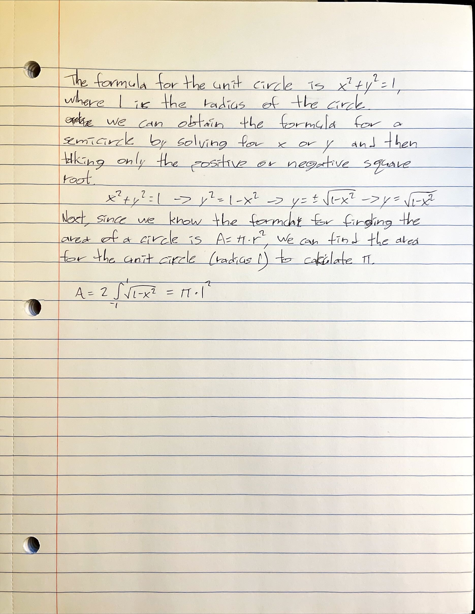

# Assignment #6

## Task 1



## Task 2

Using the method from task 1, I wrote C code that uses the trapezoid rule to calculate the integral and approximate pi:

### Code (`task2.c`):

```c
#include <stdio.h>
#include <math.h>

// function used in approximation (half circle)
double f(double x) {
    return sqrt(1 - (x * x));
}

// trapezoid rule to approximate integrals
double trapezoidRule(double (*f)(double), double lower, double upper, int n) {
    double x, sum, result;
    double h = fabs(upper - lower) / n;

    for(int i = 1; i < n; i++) {
        x = lower + i * h;
        sum += f(x);
    }

    result = (h / 2) * (f(lower) + f(upper) + 2 * sum);

    return result;
}

// driver code
int main() {
    double pi = 2 * trapezoidRule(f, -1, 1, 100000);
    printf("approximate value of pi: %.10f\n", pi);

    return 0;
}
```
I used the `main` function to test my code, and used 100,000 iterations. 

Compiling the code:

```shell
% gcc -c task2.c
% gcc -o task2 task2.o
```

Running the code:

```shell
% ./task2
approximate value of pi: 3.1415925484
```


## Task 3

I modified my code from task 2 to use the OpenMP library for multithreading:

### Code (`task2.c`):

```c
#include <stdio.h>
#include <math.h>
#include <omp.h>

// I have an 8 core CPU, so I set this to 8
#define NUM_THREADS 8

// function used in approximation (half circle)
double f(double x) {
    return sqrt(1 - (x * x));
}

// trapezoid rule to approximate integrals
double trapezoidRule(double (*f)(double), double lower, double upper, int n) {
    double x;
    double sum[NUM_THREADS];
    double result = 0;
    double h = fabs(upper - lower) / n;
    int totalThreadsCt = 0;

    omp_set_num_threads(NUM_THREADS);
    #pragma omp parallel
    {
        int thread = omp_get_thread_num();
        int totalThreads = omp_get_num_threads();
        if (thread == 0) totalThreadsCt = totalThreads;

        for(int i = 1; i < n; i = i + totalThreads) {
            x = lower + i * h;
            sum[thread] += f(x);
        }

    }


    for(int i = 0; i < totalThreadsCt; i++) {
        result += sum[i];
    }
    
    return result * h;
}

// driver code
int main() {
    double pi = 2 * trapezoidRule(f, -1, 1, 10000000);
    printf("approximate value of pi: %.10f\n", pi);

    return 0;
}
```

My system is configured a little differently, so to compile this I had to specify the libraries:

```shell
% gcc -c task3.c
% gcc -o task3 task3.o -lm -lgomp
```

Running the code produced a more precise result (since I increased the number of iterations):

```shell
% ./task2
approximate value of pi: 3.1415926535
```


## Task 5

I implemented the linear algebra functions in python:

### Code (`task5.py`):

```py
from math import sqrt
import numpy as np

def add_vector(v1, v2):
    return [v1[i] + v2[i] for i in range(len(v1))]


def subtract_vector(v1, v2):
    return [v1[i] - v2[i] for i in range(len(v1))]


def mult_s_vector(v, s):
    return [v[i] * s for i in range(len(v))]


def l1_vector(v):
    l = [abs(v[i]) for i in range(len(v))]
    return sum(l)


def l2_vector(v):
    l = [v[i] * v[i] for i in range(len(v))]
    return sqrt(sum(l))


def inf_vector(v):
    l = [abs(v[i]) for i in range(len(v))]
    return max(l)


def dot_vector(v1, v2):
    v = [v1[i] * v2[i] for i in range(len(v1))]
    return sum(v)


def cross_vector(v1, v2):
    a = v1[1] * v2[2] - v1[2] * v2[1]
    b = v1[2] * v2[0] - v1[0] * v2[2]
    c = v1[0] * v2[1] - v1[1] * v2[0]
    return [a, b, c]


def triple_vector(v1, v2, v3):
    return dot_vector(cross_vector(v1, v2), v3)


def action_matrix(m, v):
    return [dot_vector(m[i], v) for i in range(len(m))]


def add_matrix(m1, m2):
    return [add_vector(m1[i], m2[i]) for i in range(len(m1))]


def subtract_matrix(m1, m2):
    return [subtract_vector(m1[i], m2[i]) for i in range(len(m1))]


def mult_matrix(m1, m2):
    r = np.zeros((len(m1), len(m2[0])))

    for i in range(len(m1)):
        for j in range(len(m2[0])):
            for k in range(len(m2)):
                r[i][j] += m1[i][k] * m2[k][j]
    return r


# driver code for testing
if __name__ == '__main__':
    print('Testing functions...')
    print(f'add_vector([1, 1, 1], [1, 1, 1]) = {add_vector([1, 1, 1], [1, 1, 1])}')
    print(f'subtract_vector([1, 1, 1], [1, 1, 1]) = {subtract_vector([1, 1, 1], [1, 1, 1])}')
    print(f'mult_s_vector([1, 1, 1], 2) = {mult_s_vector([1, 1, 1], 2)}')
    print(f'l1_vector([1, 2, 3]) = {l1_vector([1, 2, 3])}')
    print(f'l2_vector([1, 2, 3]) = {l2_vector([1, 2, 3])}')
    print(f'inf_vector([1, 2, 3]) = {inf_vector([1, 2, 3])}')
    print(f'dot_vector([1, 1, 1], [1, 1, 1]) = {dot_vector([1, 1, 1], [1, 1, 1])}')
    print(f'cross_vector([1, 1, 1], [1, 1, 1]) = {cross_vector([1, 1, 1], [1, 1, 1])}')
    print(f'triple_vector([1, 1, 1], [1, 1, 1], [1, 2, 3]) = {triple_vector([1, 1, 1], [1, 1, 1], [1, 2, 3])}')

    m1 = [[1, 2, 3],
          [4, 5, 6],
          [7, 8, 9]]

    m2 = [[1, 0, 0],
          [0, 1, 0],
          [0, 0, 1]]

    print(f'm1 = {m1}')
    print(f'm2 = {m2}')
    print(f'action_matrix(m1, [1, 2, 3]) = {action_matrix(m1, [1, 2, 3])}')
    print(f'add_matrix(m1, m2) = {add_matrix(m1, m2)}')
    print(f'subtract_matrix(m1, m2) = {subtract_matrix(m1, m2)}')
    print(f'mult_matrix(m1, m2) = {mult_matrix(m1, m2)}')
```

The driver code at the bottom allows me to test the functions by running the file directly in the command line, which provides the following output:

```shell
% python task5.py
Testing functions...
add_vector([1, 1, 1], [1, 1, 1]) = [2, 2, 2]
subtract_vector([1, 1, 1], [1, 1, 1]) = [0, 0, 0]
mult_s_vector([1, 1, 1], 2) = [2, 2, 2]
l1_vector([1, 2, 3]) = 6
l2_vector([1, 2, 3]) = 3.7416573867739413
inf_vector([1, 2, 3]) = 3
dot_vector([1, 1, 1], [1, 1, 1]) = 3
cross_vector([1, 1, 1], [1, 1, 1]) = [0, 0, 0]
triple_vector([1, 1, 1], [1, 1, 1], [1, 2, 3]) = 0
m1 = [[1, 2, 3], [4, 5, 6], [7, 8, 9]]
m2 = [[1, 0, 0], [0, 1, 0], [0, 0, 1]]
action_matrix(m1, [1, 2, 3]) = [14, 32, 50]
add_matrix(m1, m2) = [[2, 2, 3], [4, 6, 6], [7, 8, 10]]
subtract_matrix(m1, m2) = [[0, 2, 3], [4, 4, 6], [7, 8, 8]]
mult_matrix(m1, m2) = [[1. 2. 3.]
 [4. 5. 6.]
 [7. 8. 9.]]
```