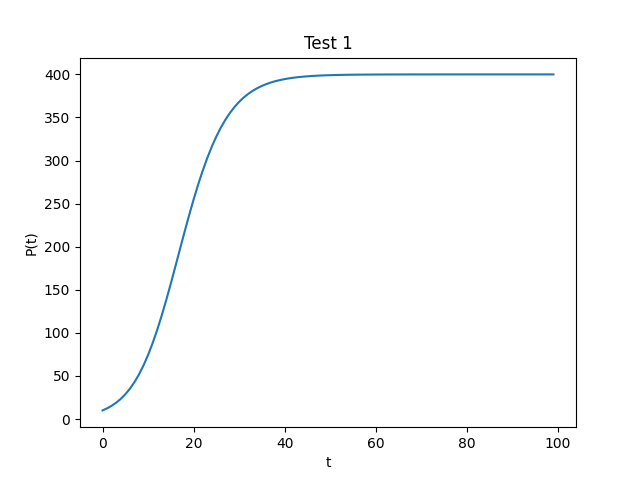

## Implicit Euler Method

### Function name: `implicit_euler`
### Language: python3
### Author: Kevin Thomas

### Description:
Uses the Implicit Euler method to solve the logistic equation. Takes an alpha and beta value, `p0`, `n`, and `h`. Returns a list of `t` and `P(t)` values. This method also uses [Newton's method](newtons_method.md) to solve the root finding problem. Output values can be used to plot a graph (see example below).

### Usage:

```py
x, y = implicit_euler(0.2, 0.0005, 10)
plt.title(f'Test 1')
plt.xlabel('t')
plt.ylabel('P(t)')
plt.plot(x, y)
plt.savefig(f"./task1/test1.png")
plt.clf()
```

Output:


### Implementation:

```py
def implicit_euler(a, b, p0, n=100, h=1):

    fp = lambda p: 1 - a * h + 2 * h * b * p
    
    p_vals = np.zeros((n), dtype=float)
    p_vals[0] = p0
    for i in range(1, n):
        f = lambda p: p - p_vals[i-1] - h * (a * p - b * p * p)
        p_vals[i] = newton(f, fp, p_vals[i-1], 0.0001, 100)

    return zip(*[[i*h, p_vals[i]] for i in range(n)])
```